# Data Job Posting Pipeline
Data Job Posting pipeline is designed to extract job posting data from a public API, transform it, and show the results in a dashboards. It is built using AWS services such as Lambda, S3, EventBridge, Glue, Athena, SNS, and multiple other services. The pipeline is designed to be serverless, meaning that it can scale automatically based on the amount of data being processed, and it does not require any infrastructure management.

# ToolBar
- [ServerlessData Job Posting Pipeline](#serverlessdata-job-posting-pipeline)
- [ToolBar](#toolbar)
- [Architecture](#architecture)
  - [Logic Flow](#logic-flow)
- [Tech Stack and Services](#tech-stack-and-services)
    - [IAM (Identity and Access Management)](#iam-identity-and-access-management)
    - [Amazon Event Bridge](#amazon-event-bridge)
    - [AWS Lambda](#aws-lambda)
    - [S3(Simple Storage Service)](#s3simple-storage-service)
    - [AWS Glue](#aws-glue)
    - [Athena](#athena)
    - [SNS(Simple Notification Service)](#snssimple-notification-service)
    - [CloudWatch](#cloudwatch)
    - [Power BI](#power-bi)
    - [CloudFormation](#cloudformation)
    - [Terraform](#terraform)
- [Analytics](#analytics)
  - [Job Posting Distribution and Salary](#job-posting-distribution-and-salary)
  - [Job Posting Type](#job-posting-type)
  - [Job Posting Experience Level(Entry, Mid, Senior, Lead, and Executive)](#job-posting-experience-levelentry-mid-senior-lead-and-executive)
- [Deployment](#deployment)


# Architecture
The architecture used in this pipeline is a serverless architecture, which means that it does not require any infrastructure management. The pipeline is designed to be event-driven, meaning that it can automatically trigger the processing of data based on events such as new data being added to an S3 bucket or a scheduled time.

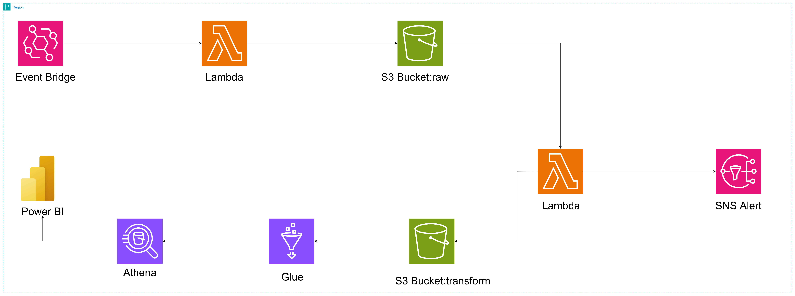
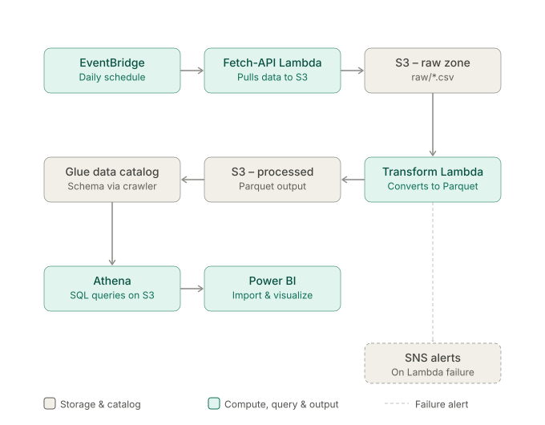

## Logic Flow

**1. Scheduled trigger (EventBridge)**
An EventBridge rule (`rate(1 day)`) fires once daily and invokes the `fetch-api-data` Lambda.

**2. Ingestion (`fetch-api-data` Lambda)**
This function calls the public job-postings API, writes the raw response to the `raw/` prefix of the S3 bucket, and exits.

**3. Ingestion triggers transformation (S3 event notification)**
Writing a new object to `raw/` fires an S3 `ObjectCreated` event, which invokes the `transform-raw-data` Lambda.

**4. Transformation (`transform-raw-data` Lambda)**
This function reads the raw file with pandas, drops incomplete records, normalizes column names and types, and derives any calculated fields needed for analysis. The cleaned result is written back to S3 under `processed/`, in Parquet rather than CSV, so downstream queries scan less data and run faster. As with ingestion, failures here are routed to SNS.

**5. Schema discovery (Glue Crawler + Data Catalog)**
A Glue crawler runs against the `processed/` prefix and registers the Parquet schema in the Glue Data Catalog.

**6. Querying (Athena)**
Athena runs standard SQL against the cataloged table directly on S3 and no data is copied into a database.

**7. Visualization (Power BI)**
Power BI either connects to Athena live via the ODBC driver or imports exported query results, and renders them as the bar charts in the `analytics/` folder — salary by experience level per role, job count by category, and job count by work mode.

**8. Failure handling (SNS)**
Both Lambda functions are configured with an `OnFailure` destination pointing at the same SNS topic, so any breakage in ingestion or transformation sends an email alert rather than failing silently.

**9. Access control (IAM)**
Each Lambda runs under its own least-privilege IAM role — `fetch-api-data` can only write to `raw/`, `transform-raw-data` can only read `raw/` and write `processed/`, and the Glue crawler's role is scoped to read `processed/` and write to the Data Catalog. No component in the pipeline has broader access than the step it performs.

# Tech Stack and Services
### IAM (Identity and Access Management)
It is a web service that helps you securely control access to AWS resources. You use IAM to control who is authenticated (signed in) and authorized (has permissions) to use resources.
### Amazon Event Bridge
It is a serverless event bus that makes it easy to connect applications together using data from your own applications. EventBridge delivers a stream of real-time data from event sources, and routes that data to targets like AWS Lambda.

### AWS Lambda
It is a serverless compute service that runs your code in response to events and automatically manages the underlying compute resources for you. You can use Lambda to run code for virtually any type of application or backend service, all with zero administration.

### S3(Simple Storage Service)
It is an object storage service that offers industry-leading scalability, data availability, security, and performance. This means customers of all sizes and industries can use it to store and protect any amount of data for a range of use cases, such as data lakes, websites, mobile applications, backup and restore, archive, enterprise applications, IoT devices, and big data analytics.

### AWS Glue
It is a fully managed extract, transform, and load (ETL) service that makes it easy for customers to prepare and load their data for analytics. You can create and run an ETL job with a few clicks in the AWS Management Console. You simply point AWS Glue to your data stored on AWS, and AWS Glue discovers your data and stores the associated metadata (e.g., table definition and schema) in the AWS Glue Data Catalog. Once cataloged, your data is immediately searchable, queryable, and available for ETL.

### Athena
It is an interactive query service that makes it easy to analyze data in Amazon S3 using standard SQL. Athena is serverless, so there is no infrastructure to manage, and you pay only for the queries that you run. Athena scales automatically—executing queries in parallel—so results are fast, even with large datasets and complex queries.

### SNS(Simple Notification Service)
It is a fully managed messaging service, it provide a low-cost infrastructure for the mass delivery of messages, emails, and notifications.

### CloudWatch
It is a monitoring and observability service. It provides data and actionable insights to monitor applications, respond to system-wide performance changes, optimize resource utilization, and get a unified view of operational health.

### Power BI
It is a business analytics service that delivers insights to enable fast, informed decisions. It provides interactive visualizations and business intelligence capabilities with an interface simple enough for end users to create their own reports and dashboards.

### CloudFormation
It is a service that helps you model and set up your Amazon Web Services resources so that you can spend less time managing those resources and more time focusing on your applications that run in AWS. You create a template that describes all the AWS resources that you want (like terraform), and AWS CloudFormation takes care of provisioning and configuring those resources for you. You don't need to individually create and configure AWS resources and figure out what's dependent on what; CloudFormation handles all of that.

### Terraform
It is an open-source IAC(infrastructure as code) software tool that provides a consistent CLI workflow to manage hundreds of cloud services. It allows you to define both cloud and on-prem resources in human-readable configuration files that you can version, reuse, and share. Terraform generates an execution plan describing what it will do to reach the desired state, and then executes it to build the described infrastructure.

# Analytics
## Job Posting Distribution and Salary
The job posting was distributed across different job categories. The following chart shows the distribution of job postings across different categories with high volume for Data Science(710) and lowest for Computer Vision(220), along with their corresponding salary averages in USD.


<table>
  <tr>
    <td align="center">
      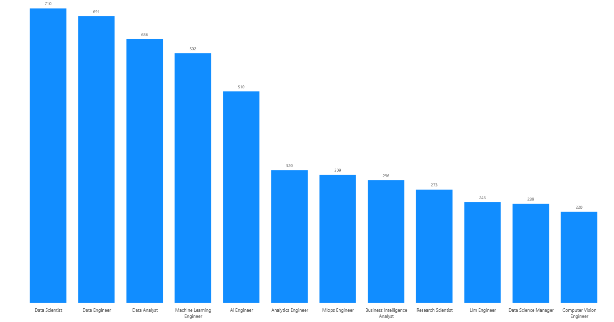
      <br/>
      <sub><b>Job Posting Distribution by Category</b></sub>
    </td>
    <td align="center">
      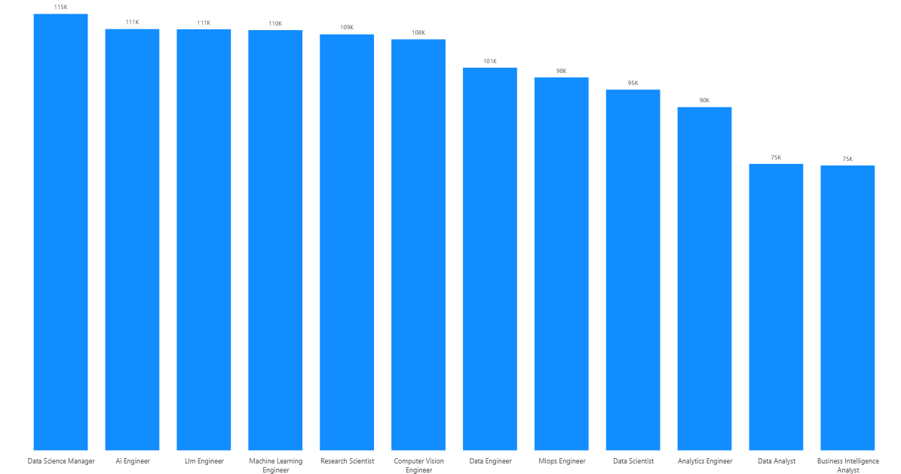
      <br/>
      <sub><b>Average Salary by Category</b></sub>
    </td>
  </tr>
</table>

## Job Posting Type
The job posting was distributed across remote, hybrid, and on-site job types. The following chart shows the distribution of job postings across different job types with high volume for on-site(2132) and lowest for remote(1436) while hybrid(1481) falls in between.

<table>
  <tr>
    <td align="center">
      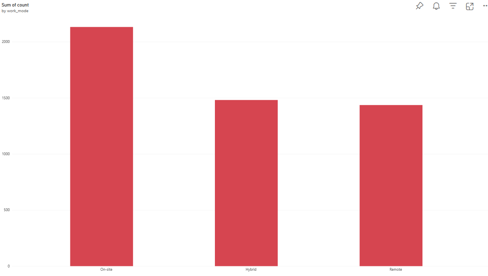
      <br/>
      <sub><b>Job Posting Distribution by Mode</b></sub>
    </td>
  </tr>
</table>

## Job Posting Experience Level(Entry, Mid, Senior, Lead, and Executive)
The job posting was distributed across different experience levels. The following chart shows the distribution of job postings across different experience levels.

<table>
  <tr>
    <td align="center">
      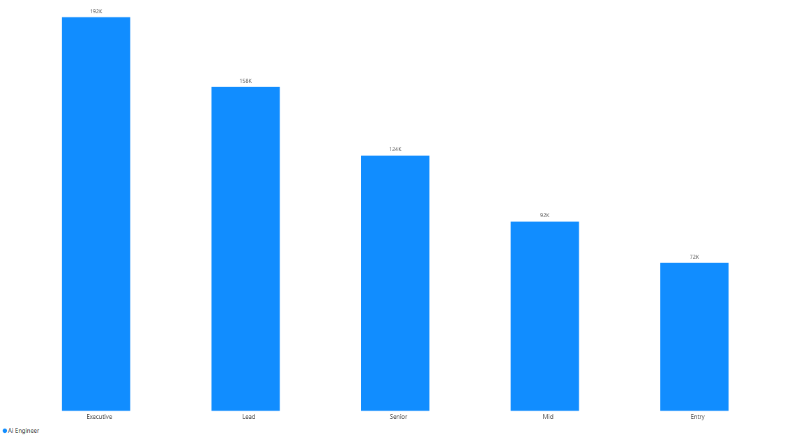
      <br/><sub><b>AI</b></sub>
    </td>
    <td align="center">
      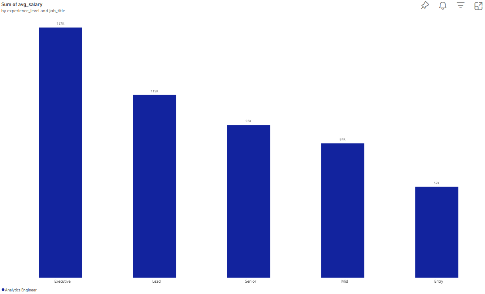
      <br/><sub><b>Analytics Engineer</b></sub>
    </td>
    <td align="center">
      
      <br/><sub><b>Business Intelligence</b></sub>
    </td>
    <td align="center">
      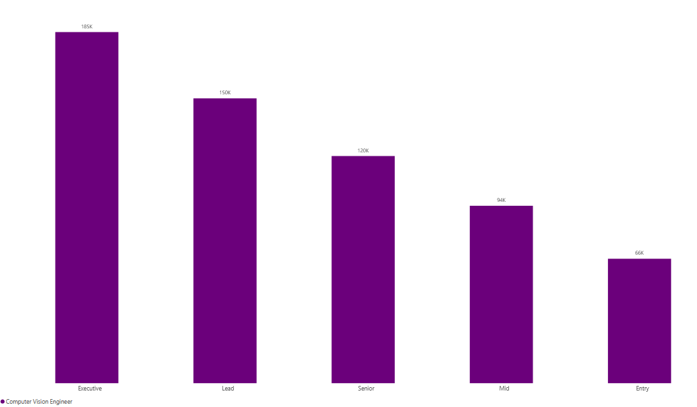
      <br/><sub><b>Computer Vision</b></sub>
    </td>
  </tr>
  <tr>
    <td align="center">
      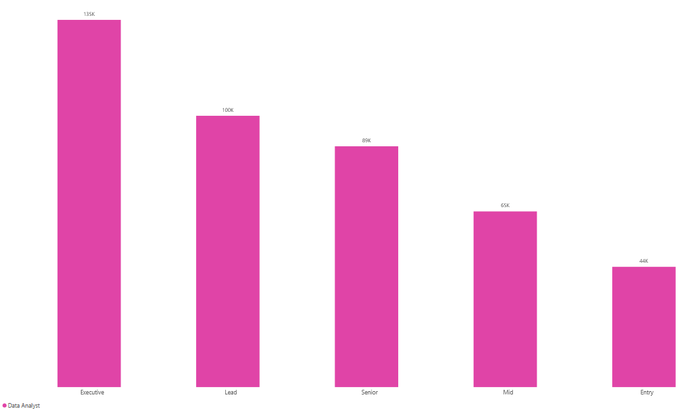
      <br/><sub><b>Data Analyst</b></sub>
    </td>
    <td align="center">
      
      <br/><sub><b>Data Scientist</b></sub>
    </td>
    <td align="center">
      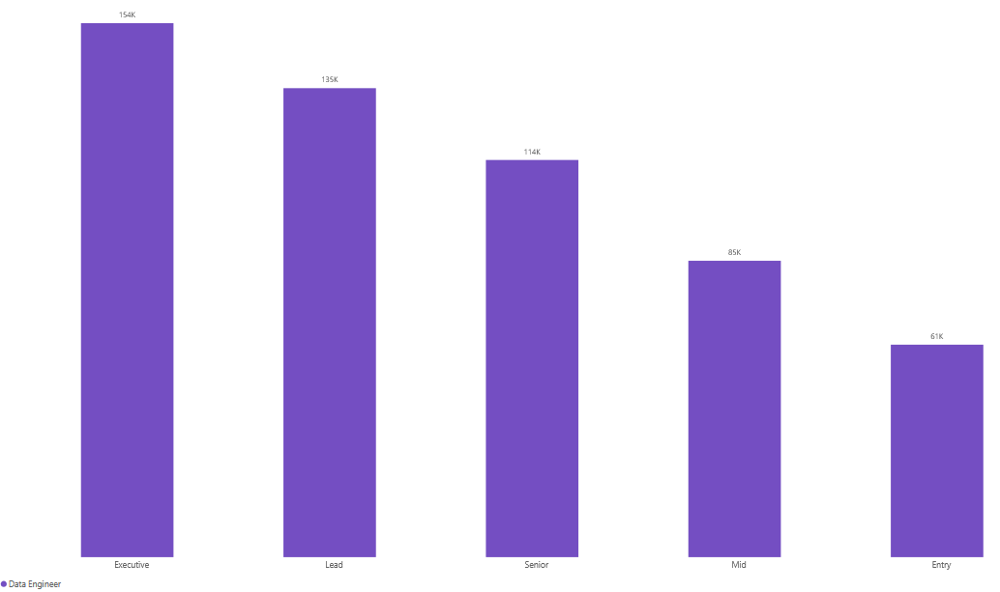
      <br/><sub><b>Data Engineer</b></sub>
    </td>
    <td align="center">
      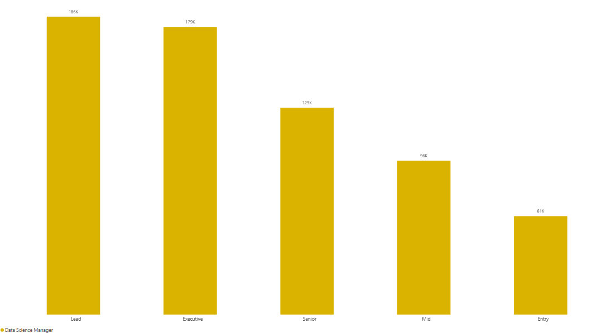
      <br/><sub><b>Data Science Manager</b></sub>
    </td>
  </tr>
  <tr>
    <td align="center">
      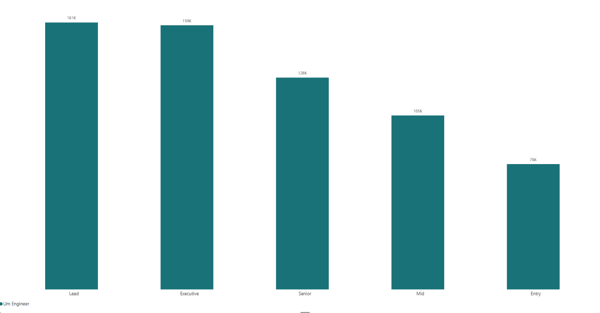
      <br/><sub><b>LLM</b></sub>
    </td>
    <td align="center">
      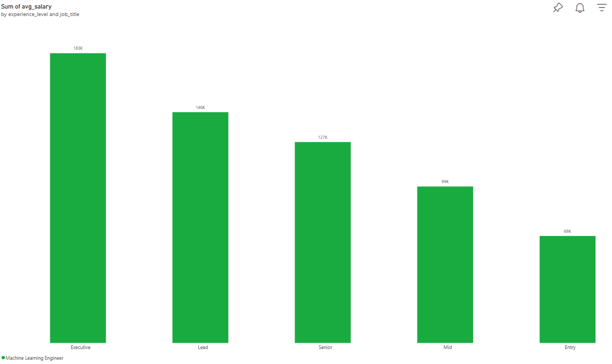
      <br/><sub><b>Machine Learning</b></sub>
    </td>
    <td align="center">
      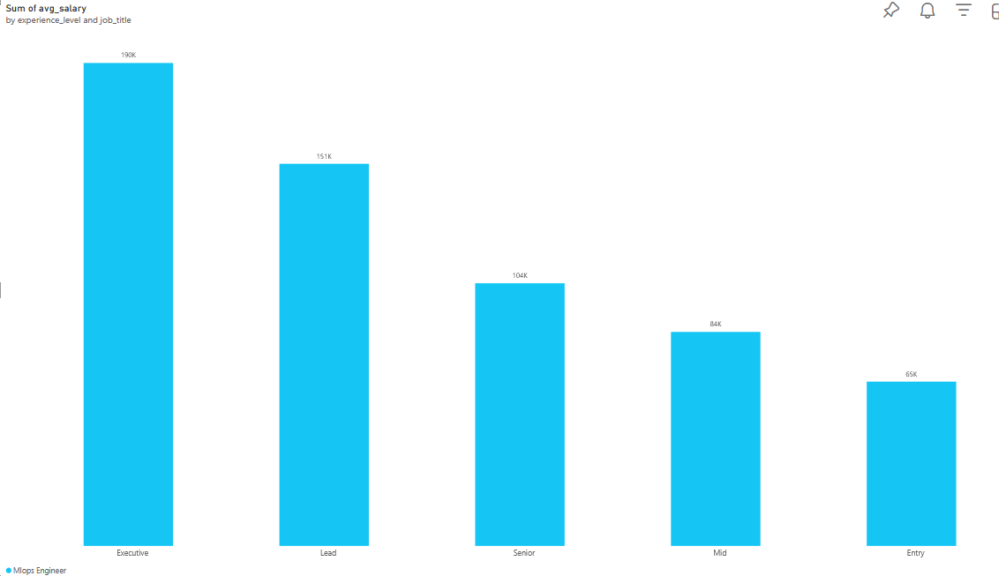
      <br/><sub><b>MLOps</b></sub>
    </td>
    <td align="center">
      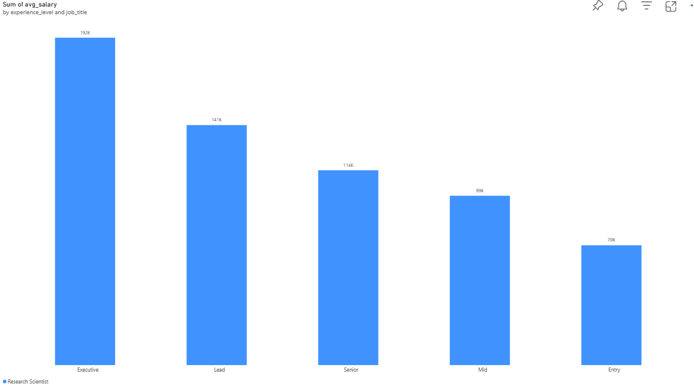
      <br/><sub><b>Recommender Systems</b></sub>
    </td>
  </tr>
</table>

# Deployment
1. Prerequisites
- AWS CLI configured with credentials (aws configure)
- An S3-compatible bucket name you control (must be globally unique)
- Current AWS-managed pandas/pyarrow Lambda layer ARN for your region

2. Deploy the core infrastructure
```bash
aws cloudformation deploy \
  --template-file data_pipeline_template.yaml \
  --stack-name data-pipeline \
  --parameter-overrides \
      BucketName=yourname-data-pipeline-2026 \
      NotificationEmail=you@example.com \
      PandasLayerArn=arn:aws:lambda:REGION:ACCOUNT:layer:LAYER-NAME:VERSION \
  --capabilities CAPABILITY_NAMED_IAM
```

3. Push the lambda code
```bash
aws lambda update-function-code --function-name transform-raw-data --zip-file fileb://transform.zip
aws lambda update-function-code --function-name fetch-api-data --zip-file fileb://fetch_api.zip
```

4. Set up the Glue crawler(console) to crawl the S3 bucket and create the necessary tables in the Glue Data Catalog.

5. Query in Athena
6. Set up the Power BI dashboard to visualize the data from Athena.